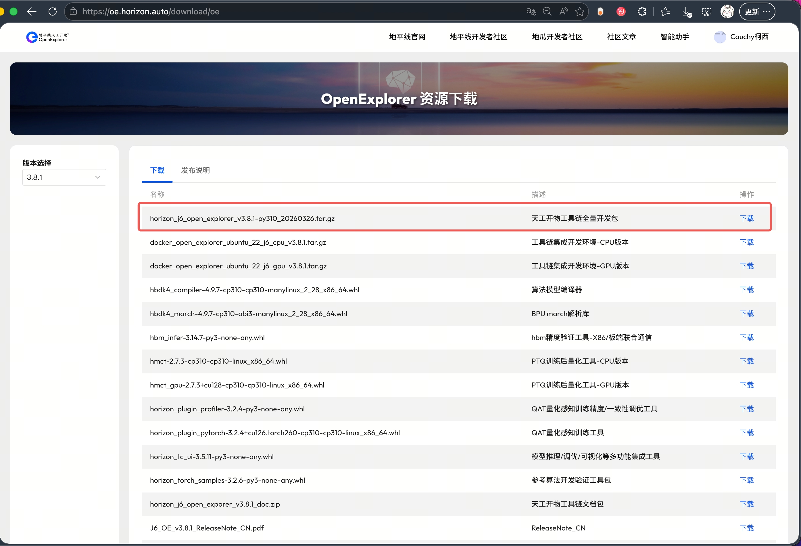

# pyCauchyKesai 安装指南

- [pyCauchyKesai 安装指南](#pycauchykesai-安装指南)
  - [环境要求](#环境要求)
  - [编译与安装](#编译与安装)
    - [第 1 步：准备 Python 环境](#第-1-步准备-python-环境)
      - [方式 A：conda](#方式-aconda)
      - [方式 B：venv（.venv）](#方式-bvenvvenv)
      - [方式 C：uv](#方式-cuv)
    - [第 2 步：构建 wheel](#第-2-步构建-wheel)
    - [第 3 步：安装](#第-3-步安装)
    - [第 4 步：验证](#第-4-步验证)
  - [移植性说明](#移植性说明)
  - [UCP相关动态库依赖关系](#ucp相关动态库依赖关系)
    - [wheel 里打包了什么？](#wheel-里打包了什么)
    - [运行时怎么加载](#运行时怎么加载)
    - [哪些库走板子系统](#哪些库走板子系统)
    - [缺库排查](#缺库排查)
  - [UCP相关动态库版本更新](#ucp相关动态库版本更新)
    - [获取 OpenExplore 包](#获取-openexplore-包)
    - [查看版本](#查看版本)
    - [组件版本](#组件版本)
    - [替换板子上OpenExplore的头文件和动态库](#替换板子上openexplore的头文件和动态库)
    - [替换pyCauchyKesai自带的头文件和动态库](#替换pycauchykesai自带的头文件和动态库)
  - [参考](#参考)

## 环境要求

| 项 | 要求 | 说明 |
|---|---|---|
| Python | 3.10–3.14 任一 | 构建与部署须用同一个 Python 环境（同版本）；pyproject requires-python >=3.10 |
| 构建后端 | scikit-build-core + pybind11 | pip 按 PEP 517 自动拉取，无需手动安装 |
| CMake | >= 3.18 | csrc/CMakeLists.txt 的下限；板子自带 3.22 即满足 |
| Ninja | 可选，加速编译 | 板子通常已装；不装也能编（回退到默认生成器） |
| glibc / GCC | 视构建系统而定 | 决定 wheel 可移植范围 |
| 系统库 | /usr/hobot/lib | 固件驱动库 |

前置依赖说明：构建依赖（scikit-build-core、pybind11、CMake）由 pip 按 PEP 517 在隔离环境自动安装，普通用户无需手动装 cmake/ninja。pycauchykesai 的运行时依赖只有 numpy（声明在 pyproject `dependencies`），`pip install wheel` 时会自动拉取。

## 编译与安装

唯一安装方式：在目标 Python 环境中构建 whl → pip install。不提供 editable 安装。

### 第 1 步：准备 Python 环境

支持 3.10–3.14 任一版本，conda、venv 或 uv 均可。**关键原则：构建与安装在同一个 Python 环境里**——构建出的 wheel 会绑定该环境的 Python 版本，装回同一环境就一定匹配、一定能 import（构建/安装命令对各版本完全一致，无需按版本改动）。

#### 方式 A：conda

```bash
conda create -n pyCauchyKesai python=3.12 -y   # 3.10–3.14 任选其一
conda activate pyCauchyKesai
```

若 `conda create` 报 `CondaToSNonInteractiveError`（anaconda 频道 Terms of Service 未接受），先运行以下两条命令再重试（每台机器只需一次）：

```bash
conda tos accept --override-channels --channel https://repo.anaconda.com/pkgs/main
conda tos accept --override-channels --channel https://repo.anaconda.com/pkgs/r
```

#### 方式 B：venv（.venv）

```bash
python3 -m venv .venv          # 跟随系统 python3，是 3.10–3.14 都行
source .venv/bin/activate
python3 -m pip install --upgrade pip
```

> [!NOTE]
> venv 用的是系统 Python，需要 python3-dev（提供 Python.h，conda 环境自带）。若板子没装：apt install python3-dev。

#### 方式 C：uv

uv 是更快的 venv/pip 替代，最大优势是 `--python` 能自动拉取指定版本（预编译、免手动装 Python）：

```bash
pip install uv                            # 走 pypi 镜像即可
uv venv --python 3.14 --seed .venv              # 3.10–3.14 任选；uv 自动下载该版本 Python；--seed 带入 pip
source .venv/bin/activate
bash scripts/build_wheels.sh              # 构建命令与方式 A/B 完全一致
uv pip install dist/pycauchykesai-*.whl   # 或普通 pip install
```

> [!NOTE]
> uv 创建的 venv **默认不带 pip**，而 `build_wheels.sh` 用 `python3 -m pip` 构建，所以必须加 `--seed`（带入 pip/setuptools），否则构建报 `No module named pip`。uv 自动下载的独立 Python 自带头文件，免装 python3-dev。

### 第 2 步：构建 wheel

```bash
# 从 Github 获取 pyCauchyKesai 的源码
git clone https://github.com/WuChao-2024/pyCauchyKesai.git  && cd pyCauchyKesai
# 编译, 适用于 Nash-{e,m,p} 平台
bash scripts/build_wheels.sh
```

构建命令对 3.10–3.14 完全一致（`build_wheels.sh` 内部用当前环境的 `python3`）。产出的 wheel 标签跟随构建 Python 自动生成，且与内部扩展 .so 一一对应：

| 构建环境 | wheel 文件名 | 内部扩展 .so |
|---|---|---|
| Python 3.10 | pycauchykesai-*-cp310-cp310-linux_aarch64.whl | pycauchykesai.cpython-310-aarch64-linux-gnu.so |
| Python 3.11 | pycauchykesai-*-cp311-cp311-linux_aarch64.whl | pycauchykesai.cpython-311-aarch64-linux-gnu.so |
| Python 3.12 | pycauchykesai-*-cp312-cp312-linux_aarch64.whl | pycauchykesai.cpython-312-aarch64-linux-gnu.so |
| Python 3.13 | pycauchykesai-*-cp313-cp313-linux_aarch64.whl | pycauchykesai.cpython-313-aarch64-linux-gnu.so |
| Python 3.14 | pycauchykesai-*-cp314-cp314-linux_aarch64.whl | pycauchykesai.cpython-314-aarch64-linux-gnu.so |

wheel 文件名绑定构建时的 Python 版本。pip 据此拒绝把高版本构建的 wheel 装进低版本环境，不会出现「装得上但 import 崩」。所以请在将要使用的同一个 Python 环境里构建（即第 1 步激活的那个）。

### 第 3 步：安装

```bash
pip install dist/pycauchykesai-*.whl
```

pip 会根据 wheel 元数据自动安装运行时依赖 numpy。

> [!NOTE]
> **numpy 版本**：pyproject 只声明 `numpy>=1.21`（极宽松下限），构建不依赖 numpy（build 隔离环境只装 scikit-build-core + pybind11，CMake 也只 `find_package(pybind11)`），wheel 里也不打包 numpy。实际版本由 pip 在安装时按当前 Python 动态解析到兼容的最新版——不同 Python/平台会得到不同版本（实测 cp310→2.2.x、cp311→2.4.x、cp312→2.5.x，均 ≥1.21）。C++ 端用 pybind11 的 `py::array`，运行时通过 `import_array()` 绑定 numpy，因此 numpy 1.x / 2.x 均可运行。

### 第 4 步：验证

```bash
python3 -c "from pyCauchyKesai import CauchyKesai, __version__ ; print(__version__)"
```

## 移植性说明

打包的 wheel 能在哪些平台和环境中运行，取决于构建机的 glibc / gcc 版本。

| 构建机 | glibc / GCC | 产出的 wheel 可运行于 |
|---|---|---|
| S100 / S100P（Ubuntu 22.04） | glibc 2.35 / GCC 11 | S100 / S100P / S600 |
| S600（Ubuntu 24.04） | glibc 2.39 / GCC 13 | 仅 S600 |

原因：S600 开发环境的 GCC 13 + glibc 2.39 头文件会让产物要求 `GLIBC_2.38` / `GLIBCXX_3.4.32`（前者来自 `__isoc23_strtol`，后者来自 `std::ios_base_library_init`），而 S100/S100P 的系统库（glibc 2.35 / libstdc++ 3.4.30）满足不了；反过来 S100/S100P（GCC 11 + glibc 2.35）盖的符号戳更低，所有更高版本的板子都能满足。

实践：要发行一个三板通用的 wheel，在 S100 或 S100P 上构建即可；S600 上构建的 wheel 供 S600 本机使用。三板的构建命令完全相同，只是产物的可移植范围不同。这是 glibc / gcc 的固有行为，非项目 bug，当前不做额外处理。

## UCP相关动态库依赖关系

### wheel 里打包了什么？

安装后位于 `site-packages/pyCauchyKesai/`：

```
pyCauchyKesai/
├── pycauchykesai.*.so   # pybind 扩展模块（文件名随构建 Python 变化，如 cpython-312）
└── lib/
    ├── libdnn.so  libhb_arm_rpc.so  libhbdsp_plugin.so  libhbhpl.so  libhbrt4.so
    ├── libhbtl.so  libhbucp.so  libhbvp.so  libhlog_wrapper.so  libperfetto_sdk.so
    └── （共 10 个，来自仓库 csrc/nash/lib/）
```

这 10 个是 UCP 相关库，打包进 wheel；其余库一律从系统找、不打包。

### 运行时怎么加载

不需要设 `LD_LIBRARY_PATH`，`__init__.py` 也不做任何手动加载，全部靠 `.so` 自带的 RPATH + ld.so 自动解析：

- pybind 模块带 **RPATH（DT_RPATH）**，首段固定为 `$ORIGIN/lib`（定位到同目录下的 `lib/`，这是加载 10 个 UCP 库的关键）。RPATH 里**可能还附带一段绝对路径**（构建机源码路径或 `/usr/hobot/lib`），属次要 fallback，运行时被 ld.so 找不到即忽略，不影响加载。
- `lib/` 内 10 个库的 RPATH 不完全一致：`libhbucp` / `libhbhpl` / `libhbdsp_plugin` / `libhlog_wrapper` / `libhb_arm_rpc` / `libperfetto_sdk` 带 `RUNPATH $ORIGIN/`；`libhbrt4` / `libhbtl` 用老式 `RPATH $ORIGIN:$ORIGIN/../lib`；`libdnn` / `libhbvp` 无 RPATH/RUNPATH 字段，靠同目录其它库间接解析。

验证模块的 RPATH：

```bash
readelf -d <site-packages>/pyCauchyKesai/pycauchykesai.*.so | grep -E 'RPATH|RUNPATH'
# 期望出现 (RPATH) Library rpath: [$ORIGIN/lib:...] —— 注意是 RPATH（0xf），第二段可能是构建机绝对路径或 /usr/hobot/lib，正常
```

### 哪些库走板子系统

10 个 UCP 库之外，还有一批**固件驱动库**和标准 C 运行时没打包，必须由板子提供：

| 类型 | 库 | 来源 |
|---|---|---|
| 固件驱动 | libbpu.so.2、libhbmem.so.1、libalog.so.1、libvdsp.so.1、libhbipcfhal.so.1、libcjson.so.1、libjsoncpp.so.25 | 板子 /usr/hobot/lib |
| 视频相关（libhbvp 专用） | libvpfhl.so.1、libmultimedia.so.1、libvpf.so.1、libgdcbin.so.1 | 板子 /usr/hobot/lib |
| 标准 C 运行时 | libstdc++.so.6、libm.so.6、libgcc_s.so.1、libc.so.6 | 系统 /lib |

板子上 `/etc/ld.so.conf.d/hobot.conf` 已把 `/usr/hobot/lib` 纳入 ld.so 默认搜索路径，正常 OE 运行环境自带这些库。这正是「ucp 库打包、其他走系统」的设计。

### 缺库排查

```bash
# 查模块及其依赖链里有没有找不到的库
ldd <site-packages>/pyCauchyKesai/pycauchykesai.*.so | grep -i 'not found'

# 确认板子是否提供该库、ld.so 缓存是否生效
ldconfig -p | grep libbpu
```

常见问题：

- `not found` 的库本应在 `/usr/hobot/lib`：确认该目录下有库、`/etc/ld.so.conf.d/hobot.conf` 存在，再 `sudo ldconfig` 刷新缓存；临时绕过 `export LD_LIBRARY_PATH=/usr/hobot/lib:$LD_LIBRARY_PATH`。
- `GLIBCXX_3.4.xx not found` 或 `GLIBC_2.xx not found`：构建机工具链比目标板新。换在低版本工具链的板子（S100/S100P，glibc 2.35）上重新构建，产物即可向下兼容。
- `readelf` 看到 RPATH 里有构建机绝对路径：正常的构建期残留，`$ORIGIN/lib` 优先生效，不影响加载。

## UCP相关动态库版本更新

### 获取 OpenExplore 包



### 查看版本

动态库：

```bash
strings <libhbucp.so 路径> | grep SO_VERSION
```

头文件：

```bash
grep -E 'HB_UCP_VERSION_(MAJOR|MINOR|PATCH)' <hb_ucp.h 路径>
```

不同位置的路径（下表 `ucp` = OE 包内 `samples/ucp_tutorial/deps_aarch64/ucp`）：

| 位置 | 动态库 | 头文件 |
|---|---|---|
| OE 包 | ucp/lib/libhbucp.so | ucp/include/hobot/hb_ucp.h |
| 仓库 | csrc/nash/lib/libhbucp.so | csrc/nash/include/hobot/hb_ucp.h |
| 板子 | /usr/hobot/lib/libhbucp.so | /usr/include/hobot/hb_ucp.h |

3.7.0 包对应输出（`MAJOR.MINOR.PATCH = 3.13.6`）：

```
SO_VERSION = (3U).(13U).(6U)
#define HB_UCP_VERSION_MAJOR 3U
#define HB_UCP_VERSION_MINOR 13U
#define HB_UCP_VERSION_PATCH 6U
```

### 组件版本

| 组件 | 3.7.0 | 3.8.1 |
|---|---|---|
| hbdk4 | 4.7.5 | 4.9.7 |
| hmct | 2.6.5 | 2.7.3 |
| horizon_tc_ui | 3.5.3 | 3.5.11 |
| ucp | 3.13.6 | 3.14.7 |
| horizon_plugin_pytorch | 3.1.5 | 3.2.4 |
| horizon_plugin_profiler | 3.1.5 | 3.2.4 |
| horizon_torch_samples | 3.1.19 | 3.2.6 |
| hbdnn | 1.0.3 | 1.0.3 |

### 替换板子上OpenExplore的头文件和动态库

OE 包 `ucp/lib/` 下是这 10 个库：

```bash
libdnn.so  libhb_arm_rpc.so  libhbdsp_plugin.so  libhbhpl.so  libhbrt4.so
libhbtl.so  libhbucp.so  libhbvp.so  libhlog_wrapper.so  libperfetto_sdk.so
```

直接覆盖板子上的动态库和头文件：

```bash
cp -f ./ucp/lib/*.so /usr/hobot/lib/
rm -rf /usr/include/hobot
cp -r ./ucp/include/hobot /usr/include/
```

### 替换pyCauchyKesai自带的头文件和动态库

pyCauchyKesai 编译/链接/打包只依赖仓库自带的这两份（唯一来源，无任何系统路径）：

- 头文件：`csrc/nash/include/hobot/`
- 动态库：`csrc/nash/lib/`

工作目录在 `pyCauchyKesai/`，OE 包已解压，用通配覆盖即可：

```bash
OE=samples/ucp_tutorial/deps_aarch64/ucp

rm -rf csrc/nash/include/hobot
cp -r $OE/include/hobot csrc/nash/include/

rm -f csrc/nash/lib/*.so
cp $OE/lib/*.so csrc/nash/lib/
```

替换后用第一节的查看版本命令，确认仓库内库、头文件与 OE 包三者一致。

## 参考

- uv 文档：https://docs.astral.sh/uv/
- Python venv 文档：https://docs.python.org/3/library/venv.html
- Miniforge：https://github.com/conda-forge/miniforge
- Miniconda：https://docs.conda.io/en/latest/miniconda.html
